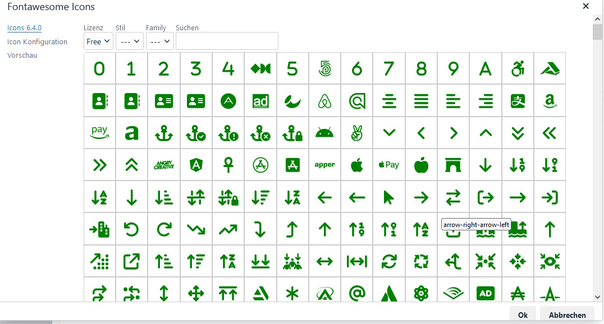

# contao-tinymce-plugin-fontawesome-bundle

# Font Awesome tinyMce Contao Backend Widget


## Abhängigkeiten
markocupic/contao-tinymce-plugin-builder-bundle  Version >
## Funktion

## Installation

## Konfiguration
Die Konfiguration wird in `config/config.yaml` gemacht.
Sind keine Einträge vorhanden, so wir die Defaulteinstellung installiert

```yaml
pbdkn_contao_tinymce_plugin_fontawesome:
    # get sourcepath for fontawesome 
    # default
    fontawesome_source_path: 'https://use.fontawesome.com/releases/v6.4.0/js/all.js'
    # Version of the metafile
    # default
    fontawesome_meta_file_version: '6.4.0'
```

 
